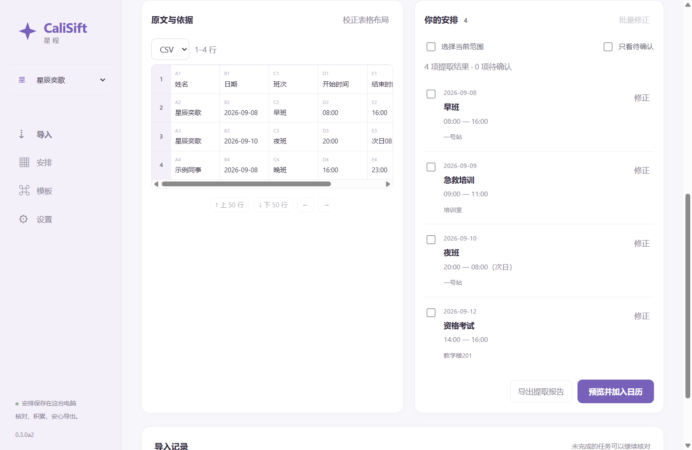

# CaliSift · 星程

[English](README.en.md) · [使用说明](docs/desktop-guide.md) · [开发与构建](docs/development.md) · [验收记录](docs/desktop-verification.md)

**把表格交给星程，只看属于你的安排。**

CaliSift 把排班表、课程表、培训通知和清晰截图里的个人安排，整理成可核对、持续更新的日历。文件在自己的电脑处理，核对后保存，需要提醒时导出到常用的日历应用。

当前为 **0.3.0-alpha.2 桌面开发预览（Windows / macOS）**。无需微信、云服务器、账号或大模型密钥。图片使用本地 RapidOCR / ONNX Runtime CPU；Excel / CSV 直接解析。



## 下载与使用

Windows x64 完整安装包通过 [Releases](https://github.com/StellarYige/CaliSift/releases) 分发，文件名为 `CaliSift-0.3.0-alpha.2-windows-x64-setup.exe`。完整包包括 Python、OCR 引擎、固定模型和 WebView2 离线安装程序。仅在缺少 WebView2 时安装该微软运行时。签名状态及验证范围见[版本说明](docs/release-0.3.0-alpha.2.md)，具体文件校验值随发行资产提供。

1. 建立具名工作区，填写原文中的完整姓名；也可以先使用“星辰奕歌”示例。
2. 选择或拖入 XLSX、XLS、CSV、PNG、JPG、JPEG；截图可以从剪贴板主动粘贴。
3. 对照完整表格或图片核对，补全待确认字段，再确认加入日历。
4. 新版到来时选择对应来源、覆盖日期，核对变更；需要时撤销最近一次来源更新。
5. 按日期、来源、分类及提醒设置导出 ICS。

macOS 分别提供 `macos-arm64.dmg` 与 `macos-x86_64.dmg`，不使用 Rosetta 混合构建。预览使用 ad-hoc 签名，尚无 Developer ID 公证；浏览器下载后的 Gatekeeper 和 Apple Calendar 仍需真机验证。最低系统及当前 CI 结果见[验收记录](docs/desktop-verification.md)。

首次使用建议先走通示例。不要把仍待确认的识别结果当成正式安排。

## 可以做什么

| 能力 | 实际行为 |
| --- | --- |
| 多次导入 | 默认追加，保留已有安排；不同姓名使用独立工作区 |
| 对照核对 | 原表分页、单元格定位、图片裁剪旋转、相关局部证据、OCR 文字修正及草稿批量修正 |
| 规则复用 | 来源班次时间、批量课程、学期复用、单双周、指定周次、表头映射、模板编辑 / 复制 / 删除及共享 |
| 来源更新 | 明确对应、明确取消、个人修正选择、跨来源贡献保留、更新撤销 |
| 持续保存 | SQLite 事务、过期预览拒绝、重启恢复草稿、隐藏恢复、归档、备份和旧小程序备份迁移 |
| 日历输出 | ICS 稳定 UID / SEQUENCE、跨夜、全天、单点时间、提醒、导出方案与历史 |
| 个性化 | 系统 / 浅色 / 深色、三档字号、间距、每周起始日、自定义分类与颜色；工作和学习同时使用 |
| 开发者使用 | 独立 Python 核心、CLI、可选 FastAPI 接口；桌面不启动业务 HTTP 服务 |

## 支持范围

Windows 11 x64 已完成本机安装和原生交互验证；macOS 15 / 26 的 Apple 芯片与 Intel 打包程序已通过 CI 中的真实启动、OCR、保存和导出。macOS 从浏览器下载后的 Gatekeeper、原生文件选择和 Apple Calendar 仍未真机验证。Linux 保留核心测试，暂不发布桌面包。

ICS 是静态文件，重复导入、删除旧安排和提醒效果取决于目标日历，**不代表自动同步成功**。已用真实 Thunderbird 155.0 验证导入器与本地日历：初次导入正确，重导入不能更新或删除旧事项。手机日历仍未实测，详见[兼容性记录](docs/calendar-compatibility.md)。

图片重点支持清晰的打印体、有边框表格和对齐清晰的简单无边框表格。手写、严重透视、模糊照片、PDF 和任意复杂周期课表不在当前支持范围。姓名精确匹配；识别错误时需要人工修正，不自动替换成相似姓名。

每批最多 10 个文件，其中图片最多 5 张；单文件 10 MiB、合计 30 MiB、单图 1200 万像素。每个工作区最多 5000 条未归档记录、100 个逻辑来源，每来源保留最近 3 次导入版本。

现有合成图片回归不能代替独立真实照片验收。20 种独立布局、20 张独立图片及外部日历兼容性门槛仍按[验收记录](docs/desktop-verification.md)跟踪；本版本不宣称任意表格可识别或已达到图片准确率目标。

## 从源码运行

需要 Python 3.11 和 Node.js 24。Windows PowerShell：

```powershell
python -m venv .venv
.venv\Scripts\python -m pip install -r requirements-lock.txt
.venv\Scripts\python -m pip install --no-deps -e .
npm ci --prefix desktop
npm run build:desktop
.venv\Scripts\python -m scripts.install_ocr
.venv\Scripts\python -m xingcheng.desktop
```

仅使用表格解析核心：`pip install -e .`，无需 OCR、桌面壳或 FastAPI。模型在准备环境时下载并校验；处理图片时不会下载模型。

```powershell
.venv\Scripts\calisift parse samples/九月排班.csv --name 星辰奕歌 --year 2026 --output report.json
```

Python 模块路径继续使用 `xingcheng`，以保留兼容性。既有事件 ID 和 `@xingcheng.local` ICS UID 不随品牌变化而重建。[更多 CLI / SDK 示例](docs/development.md)

## 本机数据与隐私

Windows 数据默认存于 `%LOCALAPPDATA%\CaliSift`，macOS 存于 `~/Library/Application Support/CaliSift`；可以用 `CALISIFT_DATA_DIR` 指定独立目录。一个目录同时只允许一个桌面或 CLI 实例写入。

未完成导入保留暂存原文件，以便重启后继续。确认或丢弃后清理整份临时原文件，长期保留提取结构、个人修正及必要的局部图片证据。手动备份包含已保存工作区及证据，不包含未完成任务原文件或 OCR 模型。

CaliSift 没有遥测、云同步或后台提醒。WebView2 是微软提供的独立共享运行时，Evergreen 模式由微软更新；这与文件的本机处理分开。[隐私与恢复说明](docs/desktop-guide.md)

## 贡献与许可

欢迎提交可公开分享的脱敏布局、复现步骤、平台兼容性结果和改进。请先阅读 [CONTRIBUTING.md](CONTRIBUTING.md) 与 [SECURITY.md](SECURITY.md)，不要把真实姓名、私人排班或截图直接贴到公开 Issue。

源码采用 [Apache-2.0](LICENSE)。第三方模型、字体、运行时及依赖分别保留其许可证，详见 [THIRD_PARTY_NOTICES.md](THIRD_PARTY_NOTICES.md) 和 [资源清单](resources/models.json)。历史微信小程序保留在 `miniprogram/` 供迁移与回归参考，停止新增功能。

本轮实现与维护边界见 [alpha.2 架构说明](docs/alpha2-architecture.md)，识别样本及贡献方法见[评测说明](docs/accuracy-corpus.md)，静态 ICS 的重复导入限制见[日历兼容性](docs/calendar-compatibility.md)。
