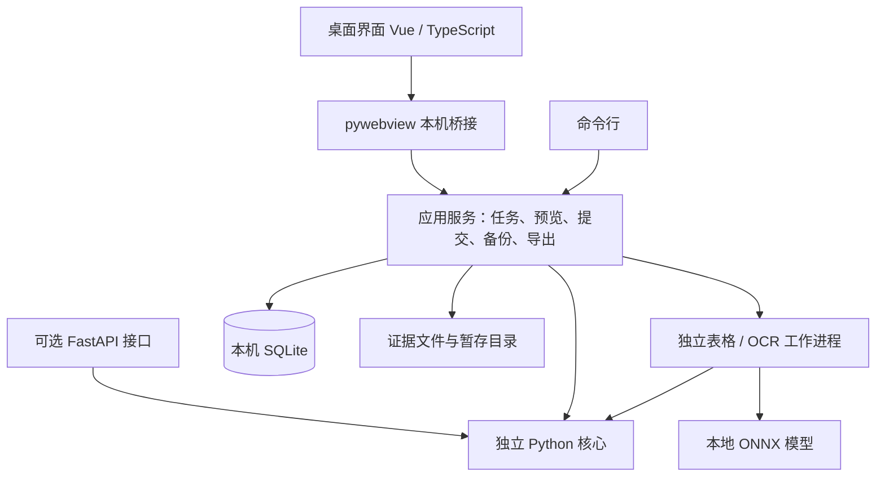

# CaliSift / 星程：开源桌面版完整实施计划

日期：2026-09-07；实施更新：2026-09-08。已实现 0.3.0-alpha.1 桌面开发预览，实际验证与剩余稳定版缺口见 [桌面验收记录](desktop-verification.md)。计划不替代验收和发布记录。

## 1. 已确定的方向与本计划默认值

用户已选择：**下载桌面软件使用；产品重心是导入、核对和日历输出**。识别、修正、来源更新和导出在自己的电脑完成，日常提醒交给外部日历。

| 项目 | 本计划默认值 |
| --- | --- |
| 英文产品名 | CaliSift，中文保留“星程”；此前工作名为 CalSift |
| 产品描述 | 把表格和截图里的个人安排，整理成可核对的日历 |
| 英文描述 | Turn rosters, timetables, and screenshots into a calendar you can verify. |
| 首个桌面版本 | 0.3.0；开发过程中使用 alpha / beta / rc 标识 |
| 首个正式支持平台 | Windows 11 x64；其他 Windows 版本实测后再列入兼容范围 |
| 后续平台 | macOS / Linux 先验证核心与源码运行，不发布未经原生验收的桌面包 |
| 主用户 | 想把排班、课程、培训和考试安排导入自己日历的人 |
| 本机身份 | 默认一个具名工作区；切换不同姓名创建独立工作区，保留原工作区 |
| 语言与时区 | 首版界面简体中文，README 中英双语；明确使用 Asia/Shanghai，不随电脑时区静默改变已有安排 |
| 开源许可 | Apache-2.0；源码、模板和第三方资源分别记录适用许可 |
| 发布位置 | GitHub 源码仓库与 Releases；首版无需自建网站或云服务 |
| 商业边界 | 按 Apache-2.0 允许使用和商业集成；不加入“禁止商用”等额外限制 |

实施说明：用户已建立仓库 https://github.com/StellarYige/CaliSift 并授权执行。产品名正式采用 CaliSift；代码采用 Apache-2.0。本文件保留此前命名调研的历史拼写，实际程序、数据目录及命令使用 CaliSift / calisift。

## 2. 英文命名与类似开源项目

### 2.1 命名建议

**首选 CalSift**：Calendar + Sift，表达“从资料中筛出自己的安排”。名称覆盖表格、图片、工作与学习，不把产品限定为排班工具。界面和仓库介绍使用“CalSift · 星程”，仓库短名建议 `calsift`，命令行建议 `calsift`。

截至本次查询：GitHub 仓库名称搜索 `calsift in:name` 返回 0 条，PyPI 的 `calsift` 项目接口返回 404。公开搜索出现研究论文里的 CalSIFT 函数名等其他用途，不能把该词描述为从未被使用。查询只是初步重名排查，不代表域名、组织名或商标可注册；实际发布前重新检查目标账号下仓库名和包名。

不建议采用以下已经出现明确软件用途的名称：

- Sheet2Cal：已有同名 Google Workspace 插件，功能是表格与 Google Calendar 间的批量操作。[产品说明](https://mhova.dev/sheet2cal)
- RosterLens：搜索发现已有同名站点；同时名称会偏向排班场景。[现有站点](https://rosterlens.com/)
- AsterCal：虽然贴近“星程”，GitHub 名称查询已经返回 `logenkain/astercal`，不作为首选。

命名只改变品牌、程序名和新入口；首版保留现有 `xingcheng` Python 模块路径。既有事件 ID、ICS UID、来源 ID 和备份标识不能随品牌更名而重建。首版不以抢占 PyPI 包名作为交付前提。

### 2.2 相近项目

以下比较依据项目当前 README、仓库结构和许可标识，不代表已经安装测试，也不使用 Star 数或项目自述作为准确率证明。

| 项目 | 当前公开说明的能力与许可 | 与星程的关系 / 值得研究的部分 |
| --- | --- | --- |
| [ICSExtractor](https://github.com/franz-sw/ICSExtractor) | Excel 排班转 ICS；设置班次时间、跨夜和单元格范围；Compose Multiplatform；Apache-2.0 | 直接相近的排班转换工具；参考来源配置和范围预览 |
| [timetableScanner](https://github.com/krishte/timetableScanner) | 课表图片转 ICS；Flask、OpenCV、Tesseract、React；MIT | 直接相近的图片工具；参考原图叠加识别结果、先校正时间再选择事项 |
| [AirCourse](https://github.com/Lounwb/AirCourse) | 中文高校课表截图经 Qwen 视觉接口提取，支持周次、节次和 ICS；MIT | 直接相近的课程入口；参考课程预览和学校作息配置，识别技术路线不同 |
| [kebiao2ics](https://github.com/hc-ui/kebiao2ics) | 浏览器本地填写课程、单双周、冲突检查、备份与 ICS；MIT | 相近的课程输出工具；参考课程编辑和日历导入指引 |
| [DueFlow](https://github.com/Ustinian5/DueFlow) | 本机截止日期规划、LLM 提取、SQLite、ICS、Tauri 桌面形态；MIT | 相邻的桌面产品；参考本机运行、发布包和数据备份组织 |

基于这些公开资料，星程可重点打磨的组合是：**本机表格与图片输入、个人安排精确关联、可定位的原文证据、可分享的规则模板、来源新版与个人修正的持续管理**。这是产品投入方向，不宣称其他项目均没有这些能力。采用其他项目代码前，单独核实所用文件的许可证并保留要求的说明。

## 3. 产品范围

### 3.1 必须保留并迁移的现有能力

- XLSX / XLS / CSV 直接解析，PNG / JPG / JPEG 使用本地 OCR。
- 姓名精确匹配、未解释线索、字段证据、待确认和冲突检查。
- 来源、导入版本、稳定事件身份、个人修正、追加和更新预览。
- 跨来源重复、其他来源仍支持的安排保留、最近来源更新撤销。
- 班次、课程、单双周和节次规则，原文时间优先，单次改期保留。
- 手工补充安排、批量修正、隐藏与恢复、基础时间线和月历预览。
- 本机备份和恢复、ICS 日期范围 / 分类 / 来源筛选及提醒参数。

### 3.2 桌面首版必须新增或补齐

- 无 Python / Node / 微信开发者工具的安装和启动体验。
- 文件选择、拖入多文件、主动粘贴剪贴板图片、鼠标裁剪和旋转。
- 可缩放、滚动和定位的原表 / 原图视图，与日程草稿联动；去掉前 20 行 / 15 列作为唯一校正视野的限制。
- 点击选择姓名区域、日期行列和字段列，预览规则影响后保存模板。
- 导入任务的进度、取消、逐文件重试和未完成草稿恢复。
- 模板独立导入 / 导出，结构匹配建议，多个候选时明确选择。
- 记住导出方案、记录导出历史、展示与上次导出相比的变化。
- 本机工作区管理、按日期归档和恢复、旧小程序备份迁移。
- 模型就绪检查、缺失 / 损坏说明、离线模型包修复入口。

### 3.3 暂不加入

不增加完整日历替代品所需的后台提醒、桌面常驻、自动开机运行、云同步、CalDAV 服务和账号体系。PDF、手写、严重透视、任意复杂课表自动理解、教务系统抓取、工资考勤、团队排班、LLM、插件市场和收费体系不进入 0.3.0。

时间线和月历用于核对与查找历史，不再作为主要首页。现有小程序停止新增功能，其微信真机验收不再阻塞桌面发布；备份迁移仍必须通过验收。

## 4. 用户流程与界面

采用左侧导航：**导入工作台、来源与历史、安排预览、规则模板、导出记录、设置**。主色沿用紫色和现有星形标识。

### 4.1 首次打开

启动检查数据目录、数据库版本、WebView2 和 OCR 模型。用户建立工作区并填写姓名；可打开打包的脱敏示例。首次安装完整包即可离线走通全流程，不需要配置服务器地址或 API Key。

### 4.2 导入工作台

1. 拖入或选择文件，也可主动粘贴图片；显示文件类型、大小和处理状态。
2. 选择追加或更新来源；默认追加。更新必须选择已有来源及覆盖日期范围。
3. 选择缺省年份、来源模板和班次规则。模板匹配只给出候选与依据，用户仍可调整。
4. 图片先做缩放查看、框选裁剪、90 度旋转，再执行识别。显示“读取、识别、还原、提取”等实际阶段；引擎未提供细粒度进度时显示不确定进度，不编造百分比。
5. 左侧原表或图片，右侧个人日程草稿；点击字段定位对应单元格或图片区域。区分原文、规则补全和手动修正。
6. 找到姓名但无法解释的线索单独列出；允许修正 OCR 文字后重新提取，保留原识别内容和修正记录。
7. 批量补日期、时间、地点、分类之前展示影响项。疑似新旧关联和个人修正冲突逐项处理。
8. 显示加入、重复、变更、取消和待确认数量。确认后写入本机；取消预览不会改变已保存的安排。

姓名继续精确匹配。无姓名的个人课表只能通过明确的个人课程配置 / 映射建立草稿，不能自动将多人表格的全部课程或班次视为本人安排。复杂周期课表暂以明确课程定义和模板为入口，不宣称任意截图都能自动展开整学期。

每批保留最多 10 个文件，其中图片最多 5 张，单文件 10 MiB、合计 30 MiB、单图最多 1200 万解码像素。长期来源数量与批次限制分别检查。

### 4.3 来源、规则和历史

来源保存名称、规则、模板绑定、覆盖日期和最近三次导入版本。上传新版时仍采用严格对应与明确取消，不使用姓名模糊匹配或疑似记录直接覆盖。

班次规则只补缺失时间，并绑定来源。课程设置第一周周一、学期周数和节次时间，支持连续节次、单双周和指定周。修改规则前显示受影响安排；临时调课仍作为单次修正。

模板导出为带版本的声明式 JSON，只包含布局、字段映射、规则和人工提供的适用说明，不包含姓名、来源文件名、截图、私人日程或绝对路径。表头由用户预览后导出，避免把个人信息混入共享模板。不允许模板执行代码或读取任意文件。

### 4.4 安排与归档

保留搜索、来源 / 分类 / 日期筛选、跨夜和冲突标识。支持手动补录、隐藏与恢复；缺少时间仍显示“时间未注明”。

默认一个工作区；创建其他姓名时建立独立工作区，切换不会清空已有数据。工作区无需账号或登录。

归档按实际结束日期筛选，先预览数量，再移出当前列表；可查询和恢复。归档不改变事件 ID。来源更新覆盖历史日期时也检查对应归档记录，避免重新生成重复安排。首版保留每工作区 5000 条未归档记录、100 个逻辑来源的保护上限，不静默删除安排。

### 4.5 导出

导出方案保存日期范围、分类、来源、提醒和文件名。导出前显示已确认可导出项、被排除项及原因；缺时间须补全或明确设为全天，单点时间不补造结束时间。

输出 ICS，另提供便于开发者检查的 JSON 报告。用户可选择保存位置、打开所在文件夹。原始图片和整张表格不进入 ICS；来源摘要只保留用户可读的逻辑来源名称，详细证据留在本机。

界面区分“已生成文件”和外部日历中的实际状态，不显示自动同步成功。首次导入建议使用专用日历；后续更新按实测客户端提供替换 / 重新导入说明，不自动清理用户其他日历。

## 5. 技术架构

选择 **Python 3.11 + pywebview + Vue 3 / TypeScript / Vite + SQLite**。新依赖在打包验证阶段固定具体版本并写入锁文件；保留现有解析与 OCR 依赖的固定版本，升级必须独立回归。

pywebview 提供 JavaScript 与 Python 的桥接，可以加载本地构建的界面资源；打包工具可以随程序提供 Python 运行时。这是保留现有 Python 核心的直接路线。[pywebview 架构](https://pywebview.flowrl.com/guide/architecture.html)、[打包文档](https://pywebview.flowrl.com/guide/freezing.html)

### 5.1 核心解耦与项目组织

继续使用一个仓库、一个 Python 核心包，不引入微服务。将公共校验模型从 HTTP 文件中抽出，作为核心依赖；`calendar.py` 不再导入 `api.py`。

按职责形成核心、应用服务、存储、桌面桥接、工作进程和可选 API 模块。前端保留可复用的日期展示逻辑和验证案例，WXML / WXSS 页面按桌面流程重建，前端不再拥有权威日历快照。

FastAPI、Uvicorn 和 multipart 依赖移到可选 `api` 安装项；OCR 仍是可选依赖，完整桌面发行包包含它。仅使用解析核心的开发者不必安装桌面壳或运行 HTTP 服务。现有 `xingcheng` 导入路径和原 HTTP 接口兼容行为在 0.3 系列保留。

保留 `SourceSeries`、`ImportRevision`、`PersonalEvent` 及当前 base / contributions / overrides 语义，不重新设计事件身份。品牌变更不能改变已有 UID。

### 5.2 应用服务与接口

桌面桥接只暴露明确的方法和经过校验的请求 / 返回类型，业务规则集中在 Python。前端维护表单和视图状态，不接受“上传任意整份日历 JSON 直接覆盖本机”的提交方式。

| 接口组 | 输入和输出约定 |
| --- | --- |
| 能力与工作区 | 返回版本、模型状态、工作区信息和存储状况；建立 / 切换独立工作区 |
| 导入任务 | 文件句柄、姓名、年份和规则 → job_id；查询阶段、结果和文件级错误；支持取消及重试 |
| 草稿与证据 | job_id、字段修正、OCR 文字修正 → 更新草稿；按证据 ID 获取选定局部区域 |
| 变化预览 | workspace_id、expected_version、draft_id 和用户选择 → preview_id、候选变化与待处理事项 |
| 确认提交 | preview_id、expected_version → 新工作区版本与摘要；不得由界面伪造候选快照 |
| 查询与规则 | 按日期 / 来源 / 分类分页查询；模板导入、导出、配置影响预览 |
| 导出与维护 | 导出方案 → ICS 文件及导出记录；备份、恢复预览、归档和撤销 |

预览与工作区版本、草稿内容和操作参数绑定。修改草稿、切换工作区、后台重试结果变化或重启后，旧预览作废；必须重新预览。提交在数据库事务内再次检查版本，重复提交同一个预览返回已提交结果，不创建重复导入。

统一提供可判断的错误码和中文下一步提示，至少包括版本变化、仍需确认、OCR 未就绪、超时、输入不支持和保存失败。

原 `/api/parse`、`/api/merge`、`/api/review`、`/api/ocr` 与日历计算 / 导出接口保持兼容，作为可选开发者接口；默认桌面程序不启动这些业务 HTTP 路由。独立 HTTP 模式默认只监听回环地址，不作为公网多用户服务发布。

### 5.3 存储与提交

SQLite 用作应用内的数据文件，不需要用户部署数据库服务。按工作区保存来源、导入版本、事件、任务草稿、模板、导出方案与记录、撤销信息和证据索引；事件复杂字段沿用已验证的 JSON 结构，日期、状态和关联字段建立查询索引。

数据目录使用 Windows 用户本地应用目录 `CaliSift`，与安装目录分离。文件组织包含数据库、不可变证据、任务暂存、模型和自动备份。源码运行支持显式配置数据目录。

写入顺序：校验候选与证据 → 将新证据写入临时文件并校验 → 移入不可变证据目录 → 数据库事务检查版本并提交。事务失败保留原数据，未被引用的文件稍后清理；不能覆盖已引用的同名证据。图片 ID 和文件校验值不一致时拒绝保存。

解析期间保留本机暂存副本，使未完成任务可恢复。确认导入或主动丢弃任务后删除整份临时原文件，只长期保留必要局部证据与提取结构。设置页列出未完成任务及暂存体积，可主动清理。日志默认不写姓名、单元格原文和图片内容。

每来源保留最近三次导入版本；仍被安排、撤销记录或草稿引用的证据不能随旧版本清理而删除。归档记录与当前记录使用同一套稳定身份。

### 5.4 工作进程与本地资源

表格与 OCR 在独立工作进程运行，桌面主线程只处理界面和任务管理。默认最多两个表格工作进程、一个 OCR 工作进程，图片串行处理。保留表格 20 秒、单图 90 秒的硬超时；界面支持取消，退出时回收自有子进程。

建立专用 `calisift-worker.exe` 打包入口，通过标准输入输出传递校验后的任务数据，Windows 隐藏进程窗口。不要继续假设打包后的 `sys.executable` 是可执行 `python -m` 的解释器。工作进程不启动桌面窗口，标准输出只用于协议，诊断写到错误通道。

保留 RapidOCR / ONNX Runtime CPU 与中文 PP-OCRv5 mobile。模型清单记录来源、版本、文件名、SHA-256、许可依据和引擎版本；安装和修复时校验，推理期间不触发下载。不确定布局、低质量图片继续进入待确认或明确失败，不回退到联网大模型。

替换当前授权未明确的 FZYTK 字体为来源和许可清楚的 Noto Sans SC 发行文件，固定校验值并随包保留 SIL OFL 文本。字体替换后重跑真实 OCR 测试；具体 ONNX 权重的再分发依据也需要归档，不能只引用引擎代码的许可证。[Noto Sans SC 许可](https://raw.githubusercontent.com/google/fonts/main/ofl/notosanssc/OFL.txt)

### 5.5 桌面资源边界

仅加载随安装包发布的本地界面。pywebview 的静态资源服务如需启动，仅绑定回环地址并限定到界面资源目录；它不提供任意本机文件下载或业务管理接口。证据通过受限句柄读取。

外部链接交给系统浏览器，不在带 Python 权限的窗口加载远程页面。表格单元格、OCR 文字和导入模板均按文本处理。文件选择、拖放和剪贴板输入经本机适配层产生受限句柄，桥接层不提供任意路径执行、shell 或代码求值能力。

## 6. 数据迁移、备份和导出可靠性

### 6.1 小程序数据迁移

支持用户选择已有 v2 JSON 备份，兼容具有完整字段的 v1 快照。桌面程序无法自动读取手机微信的私有目录，迁移入口明确说明先从小程序导出备份。

先在暂存区校验姓名、记录数、来源、修正历史、校验值和证据引用，显示摘要。默认导入为独立工作区；替换已有工作区须明确选择并先创建安全备份。损坏数据或未知版本拒绝导入，原数据不变。

保留事件 ID、来源 ID、贡献关系、个人修正、历史版本和已有 ICS UID / 序号。老记录缺失新字段时使用有文档的迁移默认值；不得用内容哈希重建稳定身份。桌面迁移成功前不删除原备份。

### 6.2 桌面备份与恢复

手动备份采用 `.calisift-backup.zip`，包括版本化 JSON 清单、已保存的安排（含待确认、隐藏、归档和取消记录）、规则模板、导出状态和仍被引用的证据；不包含模型和整份任务暂存原文件。备份摘要明确未完成任务原文件不在其中。

程序升级、数据库迁移及覆盖恢复前创建 SQLite 一致性备份，使用备份 API，不直接复制可能正在写入的数据库文件。正常变更后每日首次成功提交也创建恢复点，保留最近七份自动备份；这是可清理的恢复副本，不涉及静默删除当前安排。[SQLite 备份 API](https://sqlite.org/backup.html)

恢复在暂存区完成格式、版本、哈希和引用校验，限制解压大小和条目数，拒绝目录穿越与不支持的条目。检查通过后才安装数据，失败回到原工作区。工作区版本单调递增，旧预览在恢复后失效。

### 6.3 ICS 身份与修订

按 RFC 5545 保留中文转义、UTF-8 字节折行、时区、跨夜、全天、单点时间和 VALARM。稳定 UID 存为长期身份，既有 UID 原样保留；新 UID 从稳定事件身份生成，不依赖文件名、事项标题或导出时间。[RFC 5545](https://www.rfc-editor.org/rfc/rfc5545)

导出记录保存方案、筛选范围、文件校验值和事件 UID / SEQUENCE / 内容指纹。重复导出相同内容不增加修订序号；时间、地点、标题或导出提醒等实际事件内容变化时递增，避免仅修改导出参数却沿用过期修订。DTSTAMP 等生成时间不参与内容变化判断。

导出从确定的工作区版本读取，写到用户指定位置的临时文件，再原子替换目标文件；取消文件选择不记为成功。只有文件保存成功才记录“已导出”。失败保留旧文件和原日历，恢复或重新导出不会重建 UID。

首版生成当前完整快照和变化摘要，不把 `METHOD:CANCEL` 文件或静态 ICS 当成可靠的跨客户端删除协议。取消事项在星程内有记录，在外部日历中的处理由实测说明指导。不同客户端的结果分别记录，不笼统宣称 iOS / Android / Outlook 全面兼容。

## 7. 开源交付

### 7.1 代码、许可与贡献

建议源码采用 Apache-2.0，允许使用、修改和商业分发，并依其要求保留许可证、修改和归属说明。它包含明确的专利授权条款，不要求所有下游修改都公开。[Apache-2.0 正文](https://www.apache.org/licenses/LICENSE-2.0)

发布前整理许可证和第三方清单；模型、字体、图标和验收样例逐项记录来源与再分发条件。用户个人数据、AppID 绑定、私有配置、日志、虚拟环境、构建产物和下载模型不能直接混入源码提交。模型通过明确的发行资产分发，不作为大型二进制加入 Git 历史。

补齐中英 README、贡献指南、隐私说明、问题反馈模板、更新记录和版本兼容说明。主要贡献入口是：脱敏布局样例、预期结果、规则模板、解析修复和平台兼容性验证。测试资料须确认可以公开；不能公开的资料只在授权范围内本机验收，不进入公共仓库。

先保留现有小程序源码和迁移测试作为历史实现，标记停止新功能开发；桌面默认安装与新贡献指南不要求微信环境。整理首次开源提交时先审查已有未跟踪文件，避免整目录盲目上传。

### 7.2 开发者入口

提供跨平台 Python 开发启动和测试命令，源码 UI 构建使用 Node；最终用户无需这些依赖。新增 `desktop` 和 `api` 可选安装项，核心和 OCR 可独立测试。

首版命令行提供：启动桌面、提取文件为 JSON 报告、按工作区 / 方案导出已确认安排、环境与模型诊断。命令行提取不自动写入日历；导出只读取已确认数据。Python 公共接口提供解析、规则应用、纯变化计算和 ICS 生成，与桌面共用模型和验证逻辑。

### 7.3 安装与发布

采用 PyInstaller 目录式打包，再使用 Inno Setup 封装为当前用户安装的 Windows 安装程序；构建工具版本和许可说明一并记录。完整安装包包括 Python、界面资源、OCR 引擎、固定模型和许可文件；检测 WebView2，缺失时使用随包的官方离线运行时安装程序。这样安装和首次识别均可离线完成。首次打包验证同时确认 ONNX DLL、字体和工作进程入口。[Inno Setup 官方说明](https://jrsoftware.org/isinfo.php)、[WebView2 分发说明](https://learn.microsoft.com/en-us/microsoft-edge/webview2/concepts/distribution)

发布完整离线安装包、源代码包、校验文件、模型修复包和版本说明。第一版不做静默自动升级；新版本安装前备份数据，卸载默认保留用户数据。没有签名证书时如实说明安装包签名状态，不要求用户关闭系统保护，也不把签名提示误写成程序故障。

GitHub Actions 执行核心、前端、模型集成和打包检查。普通 PR 的轻量测试与真实模型测试分开显示；打包发布必须执行真实模型测试，模型缺失、下载失败或超时不能被静默跳过算作通过。跨平台核心 CI 通过不等于跨平台桌面已支持。

发布分为两个门槛：开发预览必须能安装、离线走通示例流程、保护已有数据并明确限制；0.3.0 稳定版必须完成下述真实布局和日历客户端验收。仓库可在预览阶段开放贡献，不把完整稳定版验收作为公开源码的前提。

## 8. 测试和验收标准

现有记录为 193 项 Python、25 项前端测试通过，Python 覆盖率 93.33%；这是 v0.2 基线，不是桌面版的新验证结果。迁移时保留对应业务行为，桌面 UI 测试替换只适用于微信的页面测试，不按测试数量考核质量。

| 范围 | 必须覆盖的场景 | 完成要求 |
| --- | --- | --- |
| 安装 / 离线 | 无 Python、Node、开发工具；有 / 无 WebView2；断网安装、启动、识别和导出 | 完整离线包走通真实文件流程，用户不启动后端、不配置地址 |
| 工作进程 | OCR / 表格超时、取消、退出、部分文件失败、模型损坏、进程崩溃 | 主界面响应，其他任务不受阻，原数据不变，重试不会重复提交 |
| 本机数据 | 磁盘满、写入中断、数据库迁移失败、证据损坏、重启恢复、多个预览同时提交 | 原数据或最近完整恢复点可用；过期提交被拒绝；重复提交幂等 |
| 导入更新 | 同名文件变化、异名同内容、跨来源重复、空新版、部分新版、改班、个人修正冲突、撤销 | 精确关联；明确确认；其他来源贡献和后续个人修正按既定语义保留 |
| 课程与时间 | 跨夜、单双周、连续节次、指定周、跨年、单次改期、缺时间 | 日期和时间结果符合人工标注，不根据节假日自行推断 |
| 桌面 UI | 1280×720、1920×1080、100% / 150% / 200% 缩放、长姓名、长路径、键盘操作、大字号 | 无不可达按钮或被遮挡关键信息，表格和图片可定位、草稿可批量核对 |
| 模板 | 共享导入 / 导出、未知版本、表头变化、多个候选、含私人字段 | 校验和预览明确；没有静默误用；共享内容不携带个人资料 |
| 迁移备份 | v1 / v2、缺证据、坏校验、备份跨电脑恢复、归档恢复、取消恢复 | 稳定 ID 与个人修正保留，失败不影响现有数据 |
| ICS | 中文、转义、字节折行、全天、单点、跨夜、提醒变化、稳定 UID、修订、保存失败 | RFC 结构回归通过；保存与导出历史一致；不伪造同步状态 |
| 客户端实测 | 至少一个桌面日历客户端、一条 iOS 日历导入路径和一条 Android 实际可用路径 | 记录客户端 / 系统版本、导入方法、新增 / 重导入 / 改期 / 取消 / 提醒的结果；无法直导时记录可行替代路径 |

准确度验收集独立于开发样例：至少 20 种表格布局和 20 张图片，覆盖工作和学习；同一布局的旋转、压缩或配色变体不重复计数。图片集同时覆盖真实截图和清晰拍照，合成回归不能替代照片适配结论。

逐项报告姓名错误关联、提取精确率与召回率、日期 / 时间字段正确率、待确认比例和人工修正操作量。干净且公开支持的 Excel 样例要求完整提取且无错误关联；图片工程目标为精确率至少 98%、召回率至少 95%，姓名错误关联为零。未达到时修正实现或收窄公开支持范围，不能只靠增加待确认项掩盖召回不足。

桌面 UI 使用真实业务服务做端到端测试；浏览器测试可验证界面逻辑，但文件选择、剪贴板、进程退出和安装必须补原生桌面验证。记录冷启动、5000 条当前安排查询 / 预览、真实 OCR 耗时和峰值内存及硬件条件；性能目标先设为主界面 5 秒内可操作、常用查询 500 毫秒内返回，达不到时优化或调整支持范围，不编造结果。

现有 90% Python 覆盖率门槛保留；覆盖率不替代真实识别准确率。未测试的平台和客户端明确标注。

## 9. 开发阶段与交付顺序

| 阶段 | 实施内容 | 阶段完成条件 |
| --- | --- | --- |
| A：桌面运行验证 | pywebview + 构建界面 + 真实 OCR 工作进程的最小完整打包；运行时、模型、字体许可检查 | 干净 Windows 机器断网安装后，选择真实图片，识别并导出；证明技术与分发路线可行 |
| B：核心与存储 | 公共模型解耦、应用服务、SQLite、工作区、事务预览提交、备份、v1 / v2 迁移 | 旧业务回归通过；重启、写入失败、过期 / 重复提交和迁移保护通过 |
| C：桌面导入核对 | 文件拖入、剪贴板、裁剪、任务队列、原文联动、字段修正与批量预览 | 多表加图片完整核对保存流程通过，取消 / 重试可用，无占位入口 |
| D：规则和版本 | 模板导入导出、来源匹配建议、班次 / 课程配置、新旧对应、修正冲突、撤销和归档 | 同一来源连续更新、跨来源贡献、单次调课及归档后再导入均正确 |
| E：输出和开源预览 | 导出方案 / 历史、ICS 修订、开发者 CLI、文档、许可、CI 和安装包 | 发布准备完整，离线工作流程通过，可作为清楚标注范围的开发预览 |
| F：稳定版验收 | 独立布局 / 图片集、Windows 原生交互、外部日历客户端、性能和升级恢复 | 所有公开承诺均有对应结果；缺口修复或收窄声明后发布 0.3.0 |

A 阶段先验证最容易阻塞桌面发行的打包与本地 OCR，避免完成全部 UI 后才发现运行时问题。B 到 E 按已存在的核心能力逐段迁移，不复制两套业务规则。F 的真实数据收集可与前面阶段同步进行；缺少设备或样本时保留未验收标识，不填写虚假的完成状态。

## 10. 最终交付定义

项目交付包含：可读可运行的开源代码、明确许可证和第三方资源清单、Windows 完整离线安装包、真实样例与复现步骤、独立准确度报告、迁移备份验证、日历客户端兼容性记录及贡献流程。

用户验收路径为：**安装 → 拖入自己的排班表或课表截图 → 对照证据核对 → 保存来源与规则 → 上传新版并处理变化 → 导出日历 → 关闭、重开及备份恢复后数据仍正确。**

运行上述核心流程无需微信、云服务器、账号或大模型密钥。软件中每个公开入口都能完成对应操作；尚未支持的复杂布局和平台如实说明。
