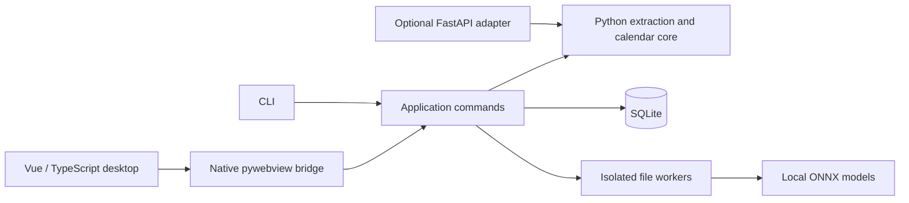

# Development and release

## Architecture



`src/xingcheng/contracts.py` contains reusable validation contracts. The core has
no FastAPI dependency. `application.py`, `localstore.py` and `jobs.py` own local
workspaces, transactional previews, idempotent commits and persisted drafts.
`desktop.py` exposes an explicit command allowlist and native dialogs; the UI
cannot commit an arbitrary authoritative calendar object. `assets.py` serves
only bundled UI files on a random loopback port, without business HTTP routes.

Stable event IDs differ from extraction content hashes. Source contributions,
original extraction and personal overrides remain separate. Updates require
explicit ambiguous matching and cancellation choices. The SQLite version and
draft digest are checked again at commit time. Reopening invalidates uncommitted
previews, while committed preview receipts remain idempotent.

## Source environment

Use Python 3.11 x64 and Node.js 24. Create `.venv`, install `requirements-lock.txt`,
then install this project editable. The lock contains the Windows desktop/test
toolchain; the minimal `pip install -e .` installs only the spreadsheet core.

```powershell
.venv\Scripts\python -m pip install -r requirements-lock.txt
.venv\Scripts\python -m pip install -e ".[desktop,ocr,api,test,build]"
npm ci --prefix desktop
npm ci
npm run build:desktop
.venv\Scripts\python -m scripts.install_ocr
.venv\Scripts\python -m xingcheng.desktop
```

Available extras: `desktop`, `ocr`, `api`, `test`, `build`. OCR files are pinned in
`resources/models.json`; downloads happen only during setup or explicit offline
repair. To run an isolated workspace, set `CALISIFT_DATA_DIR` before launch.
Source model lookup can be overridden with `XINGCHENG_OCR_MODELS`.

Vite's development browser alone has no privileged backend and is not a full
desktop instance. Rebuild the UI and launch `xingcheng.desktop` for native work.
There is no fake browser backend in the shipped product.

## CLI and Python SDK

The source console command is `calisift`. The shipped Windows executable is
`calisift-cli.exe`; the GUI is `CaliSift.exe` and the isolated worker is
`calisift-worker.exe`. Distinct names are necessary on Windows's case-insensitive
filesystem. The frozen worker explicitly uses UTF-8 on stdin/stdout.

```powershell
calisift parse samples/九月排班.csv --name 星辰奕歌 --year 2026 --output report.json
calisift --data-dir .scratch-calendar workspace --create 星辰奕歌
calisift --data-dir .scratch-calendar workspace
calisift --data-dir .scratch-calendar doctor
# Use the returned workspace ID:
calisift --data-dir .scratch-calendar import samples/九月排班.csv --workspace WORKSPACE_ID --year 2026
calisift --data-dir .scratch-calendar import samples/培训通知.csv --workspace WORKSPACE_ID --year 2026 --commit
calisift --data-dir .scratch-calendar export --workspace WORKSPACE_ID --output calendar.ics
calisift --data-dir .scratch-calendar backup --workspace WORKSPACE_ID --output backup.zip
calisift --data-dir .scratch-calendar restore backup.zip
```

Import persists a reviewable draft. `--commit` explicitly confirms the computed
append preview. For an existing draft, use `change --operation operation.json
--job JOB_ID --workspace WORKSPACE_ID --expected-version N --commit`. Without
`--commit`, calendar mutations are previews only. Each CLI invocation is a new
session; regenerate previews when committing in a later invocation. `restore
--commit` creates an independent workspace. Do not run the desktop and a writing
CLI on the same data directory simultaneously.

```python
from pathlib import Path
from xingcheng.parsing import parse_file
from xingcheng.calendar import empty_calendar, transform, export_ics

report = parse_file(Path("samples/九月排班.csv").read_bytes(), "排班.csv", "星辰奕歌", 2026)
preview = transform(empty_calendar("星辰奕歌"), 0, {
    "type": "append", "source_name": "工作排班", "report": report.to_dict()
})
# Inspect preview['summary'] before accepting the returned candidate.
Path("calendar.ics").write_bytes(export_ics(preview["calendar"], {"alarm": 15}).encode("utf-8"))
```

The SDK core above is stateless. For local transactional storage use
`Application(root)`, `preview_change`, `commit_change`, and always call `close()`.
The optional API starts with `python -m uvicorn xingcheng.api:app --host 127.0.0.1
--port 8000`. Existing `/api/parse`, `/api/merge`, `/api/review`, `/api/ocr`, calendar
transform, course and export routes remain compatible. This API has no hosted
account or authorization model; do not expose it as a public multi-user service.

## Verification

```powershell
$env:CALISIFT_REQUIRE_OCR = '1'
.venv\Scripts\python -m pytest --cov=xingcheng --cov-branch --cov-fail-under=90
npm test
npm test --prefix desktop
npm run build:desktop
.venv\Scripts\python -m scripts.smoke_desktop
.venv\Scripts\python -m scripts.smoke_packaged dist/CaliSift/CaliSift.exe
.venv\Scripts\python -m scripts.smoke_frozen_workers
.venv\Scripts\python -m scripts.smoke_install artifacts/release/CaliSift-0.3.0-alpha.1-windows-x64-setup.exe
.venv\Scripts\python -m scripts.benchmark_desktop
```

The full gate must run the real models. `CALISIFT_REQUIRE_OCR=1` makes missing or
damaged resources an error, rather than allowing model tests to skip. Mock OCR
output is used only for error/boundary cases. Native smoke tests use temporary
data directories and actual Windows windows. The packaged smoke drives UI
Automation, native file dialogs and the shipped worker, with Python/Node removed
from PATH. It writes results under `artifacts/`.

Accuracy evaluation: `python -m scripts.evaluate_accuracy MANIFEST --output
REPORT.json`. Add `--acceptance` to enforce the independent-layout/image gates.
Development fixtures are explicitly synthetic and cannot pass the stable
acceptance gate. See the manifest format in `tests/fixtures/ocr/regression-manifest.json`.

Frontend formatting uses the pinned Prettier version in `desktop/package.json`;
Python source is formatted with Black 25.1.0. Historical WeChat Node tests remain
as migration regression coverage. Public mini-program configs use `touristappid`;
use your own AppID for historical native tests.

## Windows packaging

```powershell
.\scripts\build-windows.ps1
```

The build script verifies models, tests, dependency notices, tool checksums and
publisher signatures; it builds three shared-runtime executables and an Inno
Setup installer. `-SkipTests` is for local packaging iteration after tests already
passed. Release automation uses the complete checks. Tool URLs and hashes are in
`resources/windows-toolchain.json`. The signed WebView2 offline installer is
included, not a network bootstrapper. Inno Setup 6.7.3's own license remains
separate from the project license.

The installer targets Windows 11 x64 and installs per-user. Before upgrading an
existing installation it asks the old CLI to create a consistent recovery point.
Failure stops the upgrade. Uninstall retains `%LOCALAPPDATA%\CaliSift`. Source
builds and installation on machines without WebView2 require the independent
verification recorded in the release checklist.

Outputs: full Windows installer, model repair ZIP, dependency source ZIP and `SHA256SUMS.txt` in
`artifacts/release/`. Source archives come from the reviewed Git tag. There is no
automatic desktop updater and no code-signing certificate configured. Publish
an alpha prerelease only after reviewing the actual build results; a successful
CI job does not substitute for calendar-client or independent-photo acceptance.
